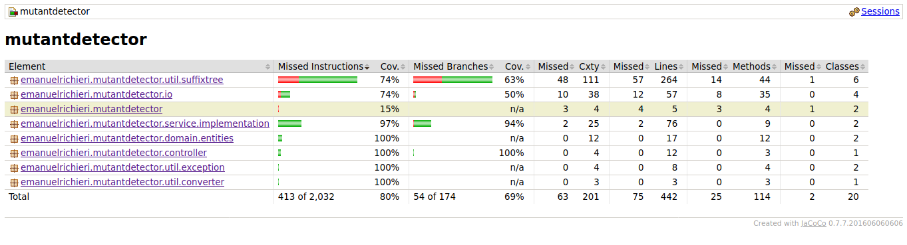

# Mutant Detector
Rest API para detectar si una secuencia de ADN pertenece a un mutante.

**Autor**: Emanuel Richieri 
-  GitHub: https://github.com/emanuelrichieri/
-  GitLab: https://gitlab.com/emanuelrichieri

## API
### Descripción general
La funcionalidad principal de la API consiste en analizar array de Strings, los cuales representan cada fila de una tabla de (NxN) con la secuencia del ADN, con el objetivo de determinar si la misma corresponde a un mutante. Las letras de los Strings solo pueden ser (A,T,C,G), las cuales representan cada base nitrogenada del ADN.
El ADN corresponde a un mutante si en la tabla se puede encontrar más de una secuencia de cuatro letras iguales​, de forma oblicua, horizontal o vertical. 

### Endpoints
La API se encuentra alojada en Google Cloud Platform y ofrece los siguientes endpoints:
#### POST /mutant
- URL: https://mutant-detector-01.rj.r.appspot.com/mutant

Se envía como parámetro un JSON, cuyo atributo "dna" contiene un string
Body params (application/json):

     {
	     "dna": ["ATGCGA", "CAGTGC", "TTATTT", "AGACGG", "GCGTCA", "TCACTG"]
     }
Cuando el ADN corresponde a un mutante, el servicio retorna un HTTP-200 OK. En caso contrario, un 403-FORBIDDEN.
También puede retornar 400-BAD REQUEST si el ADN enviado no cumple con las características especificadas.

Ejemplo de respuesta esperada (mutante):

       HttpStatus: 200 - OK 
       Body (application/json):
    {
	    "success": false,
	    "message": "MUTANT",
	    "data": {
	        "dna": [
	            "ATGCGA",
	            "AATGGC",
	            "ATATTT",
	            "AGAATG",
	            "GCGTCA",
	            "TCACTG"
	        ]
	    },
	    "status": "OK"
    }

Ejemplo de respuesta esperada (no-mutante):

       HttpStatus: 403 - FORBIDDEN 
       Body (application/json):
    {
	    "success": false,
	    "message": "HUMAN",
	    "data": {
	        "dna": [
	            "ATGCGA",
	            "CAGTGC",
	            "TTATTT",
	            "AGACGG",
	            "GCGTCA",
	            "TCACTG"
	        ]
	    },
	    "status": "FORBIDDEN"
    }

#### GET  /stats 
- URL: https://mutant-detector-01.rj.r.appspot.com/stats

Ejemplo de respuesta:

       HttpStatus: 200 - OK 
       Body (application/json):
       {
	    "count_mutant_dna": 5,
	    "count_human_dna": 1,
	    "ratio": 5.0
	   }

## Tecnologías y herramientas
- **Java 8** - Lenguaje de programación
- **Git** - Control de versiones
- **SpringBoot** - Framework de microservicios
- **Maven** - Gestión de paquetes y dependencias
- **Google Cloud Platform / AppEngine** - alojamiento de infraestructura en la nube 
- **JUnit / Mockito** - Desarrollo de tests unitarios 
- **JaCoCo** - Reportes de Tests Code Coverage
- **Eclipse + Spring Tools Suite** - Entorno de desarrollo

## Consideraciones del desarrollo
### Verificación de ADN
Para la búsqueda de las secuencias que definen un ADN como mutante se utilizó un Árbol de Sufijos Generalizado (**[*Generalized Suffix Tree*](https://en.wikipedia.org/wiki/Generalized_suffix_tree)**). La elección del mismo reside en su gran eficiencia y amplia utilización en el campo de la bioinformática.
Para la implementación de este algoritmo se utilizó como base el proyecto de [abahgat](https://github.com/abahgat/suffixtree) , realizando algunas modificaciones para este proyecto en particular y agregando comentarios para facilitar la comprensión del código.
#### Descripción general del algoritmo
Dado el array de strings que componen el ADN, en primer lugar se obtienen todas las cadenas de longitud mayor o igual que 4 (la longitud mínima de letras consecutivas iguales necesaria) resultantes de la Tabla de NxN, en posición horizontal, vertical u oblicua.
Posteriormente, a partir de todas esas cadenas se construye el Suffix Tree, utilizando el [Algoritmo de Ukkonen](https://es.wikipedia.org/wiki/Algoritmo_de_Ukkonen) para hacerlo con una complejidad de O(*n*), donde *n* es la longitud de la cadena.
Una vez construido el árbol, se procede a buscar cada secuencia (AAAA, CCCC, GGGG o TTTT) desde la raíz. El mecanismo de búsqueda es sencillo, cada arista está etiquetada con una subcadena y deriva en un nodo que contiene un apuntador a la posición de comienzo de dicha subcadena. Se recorre el árbol y se concatenan las aristas buscando encontrar un camino que contenga la secuencia buscada. Esto es sumamente eficiente, puesto que se realiza con una complejidad de O(*m+z*), donde para este caso m=4 (la longitud del patrón buscado) y *z=2* (la cantidad de ocurrencias necesarias).

### Tests Code Coverage
Para la evaluación de [Code Coverage](https://es.wikipedia.org/wiki/Cobertura_de_c%C3%B3digo) se utilizó la herramienta JaCoCo. 
La misma arrojó como resultado un 80% de Code Coverage, lo cual se considera aceptable, dado que las funcionalidades críticas están cubiertas en su totalidad. 

### Infraestrucutra y fluctuaciones de tráfico
La infraestructura de la API puede escalarse de forma transparente dado el hecho que está desplegada en la Nube. Para aceptar mayores fluctuaciones de tráfico puede modificarse el archivo src/main/resources/WEB-INF/appengine-web.xml. 
Allí pueden ajustarse especialmente los parámetros como cantidad mínima y máxima de instancias, y la cantidad máxima de peticiones que podrá procesar cada instancia antes de que una nueva sea generada. De esta manera podrían controlarse las fluctuaciones de tráfico sin mayores complicaciones.
Para ver las distintas configuraciones de escalamiento, consultar https://cloud.google.com/appengine/docs/standard/java/config/appref?hl=es-419#scaling_elements.

## Instalación
### Pre-requisitos
> **Nota:** el proyecto fue desarrollado en base a Google Cloud Platform, con lo cual el README seguirá estos lineamientos. Sin embargo, puede ejecutarse localmente utilizando otras tecnologías configurando correctamente el archivo application.properties y las dependencias en el archivo pom.xml.

-   Tener una cuenta en Google Cloud Platform (GCP).
-   [Maven](https://maven.apache.org/) >= 3.5 
- [Google Cloud SDK](https://cloud.google.com/sdk/docs?hl=es-419) y el componente    `google-cloud-sdk-app-engine-java`

### 1. Configuración de instancia en AppEngine en Google Cloud Platform
> **Nota**: para la configuración de GCP, se utilizó como base el tutorial expuesto en https://medium.com/@adamofig/spring-boot-y-google-cloud-sql-cloud-app-engine-la-forma-m%C3%A1s-f%C3%A1cil-ca1c3f5a051

#### 1.1 - Crear instancia de AppEngine 
En GCP, crear una instancia de App Engine, para este caso seleccionar el lenguaje Java, elegir la zona, y esperar a que se configure.

#### 1.2 - Dar permisos a Cliente SQL en GCP
En [https://console.cloud.google.com/iam-admin/iam](https://console.cloud.google.com/iam-admin/iam), se encuentran las cuentas y permisos, buscar la cuenta similar a “_project-id_@appspot.gserviceaccount.com“  . La cuenta se encarga de manejar tu instancia de AppEngine.
Click en el lápiz para editar y clic agregar función. En el selector buscar Cloud Sql y el valor debe ser Cliente de Sql.

#### 1.3 - Activar API de SQL Cloud
En el siguiente enlace [https://console.cloud.google.com/apis/library](https://console.cloud.google.com/apis/library)  
buscar exactamente “Cloud SQL Admin API” y habilitarla.

#### 1.4 - Descargar claves de la cuenta y configurar keys.json
[https://console.cloud.google.com/apis/credentials/serviceaccountkey](https://console.cloud.google.com/apis/credentials/serviceaccountkey)  
* Crear clave de servicio de cuenta.  
* Seleccionar AppEngine default service account  
* Seleccionar JSON y dar click en crear.
* Sustituir el JSON descargado en src/main/resources/keys.json.

#### 1.5 - Crear base de datos
En [https://console.cloud.google.com/sql/instances](https://console.cloud.google.com/sql/instances) :

- Ir a Bases de Datos 
- Crear base de datos PostgreSQL (opcional), si se elige otro motor de DB tener en cuenta modificar la property *spring.jpa.database-platform* en el application.properties)
- En el archivo src/main/resources/application.properties reemplazar la siguiente información:
	-   spring.cloud.gcp.sql.database-name= YOUR_DATABASE_NAME
	-   spring.cloud.gcp.sql.instance-connection-name= YOUR:INTANCE:NAME
	-   spring.datasource.username= YOUR_DATABASE_USER
	-   spring.datasource.password= YOUR_DATABASE_PASSWORD
	-   spring.cloud.gcp.project-id= YOUR_PROJECT_ID 
	- *spring.jpa.database-platform* = dialecto correspondiente si no se elige  PostgreSQL

#### 1.6 - Habilitar red ip pública (opcional)
En [https://console.cloud.google.com/sql/instances](https://console.cloud.google.com/sql/instances) editar la instancia SQL correspondiente al proyecto y en "Conectividad" agregar la red autorizada 0.0.0.0/0, para acceder desde cualquier IP a la instancia.

### 2 - Ejecutar localmente
En una consola de comandos desde el directorio raíz del proyecto ejecutar

    mvn clean install -U
    mvn appengine:run

Si se quiere omitir las pruebas unitarias al ejecutar/deployar, se debe agregar -DskipTests al comando appengine:{run/deploy}

    mvn appengine:run -DskipTests

También puede ejecutarse localmente a través de un IDE como eclipse utilizando SpringBoot. 

### 3 - Desplegar en Google Cloud Platform
- Asegurarse de [tener instalado el SDK con los componentes de JAVA](https://cloud.google.com/appengine/docs/standard/java) 
- Abrir una consola de comandos y ejecutar

    gcloud init

- Configurar el proyecto según corresponde
- Ejecutar

    mvn appengine:deploy

El proyecto correrá por defecto en http://localhost:8080
